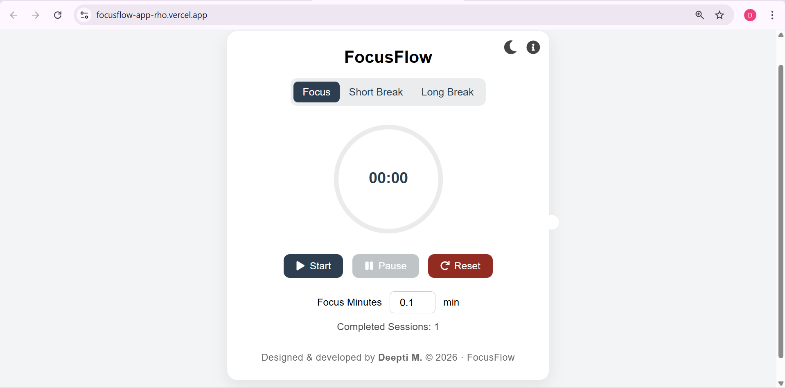

# FocusFlow

<p align="center">
  <strong>A modern, minimalist focus timer built with React and Vite.</strong><br/>
  Designed to improve productivity through clean UI and intentional time management.
</p>

<p align="center">
  <a href="https://focusflow-app-rho.vercel.app/" target="_blank"><strong>Live Demo</strong></a>
</p>

## Overview

FocusFlow is a productivity-focused web application designed to help users manage work sessions efficiently.  
Built with React and powered by Vite, the application emphasizes performance, simplicity, and a distraction-free interface.

The project demonstrates component-based architecture, custom hooks, scalable folder structure, and professional deployment workflow.

## Live Demo

The application is deployed on Vercel:

[https://focusflow-app-rho.vercel.app/](https://focusflow-app-rho.vercel.app/)

## Screenshots

Screenshots are stored inside:

```
public/assets/
```

Example:

```
public/assets/focusflow-ui.png
```

To display screenshots in the README, use:

```markdown

```

## Features

- Custom focus timer logic using a reusable hook (`useTimer`)
- Interactive duration input controls
- Circular progress visualization
- Session counter tracking
- Mode switching functionality
- Clean and responsive UI
- Custom favicon and PWA-ready manifest setup
- Optimized production build via Vite

## Tech Stack

- React
- Vite
- JavaScript (ES6+)
- CSS
- Node.js & npm
- ESLint

## Project Structure

```
focusflow/
│
├── node_modules/
├── dist/
│
├── public/
│   ├── assets/
│   │   └── screenshots of UI
│   │
│   ├── web-app-manifest-192x192.png
│   ├── web-app-manifest-512x512.png
│   ├── site.webmanifest
│   ├── favicon.ico
│   ├── favicon.svg
│   ├── favicon-96x96.png
│   └── apple-touch-icon.png
│
├── src/
│   │
│   ├── components/
│   │   ├── Controls.jsx
│   │   ├── DurationInput.jsx
│   │   ├── Footer.jsx
│   │   ├── HeaderIcons.jsx
│   │   ├── ModeSwitcher.jsx
│   │   ├── ProgressRing.jsx
│   │   ├── SessionCounter.jsx
│   │   └── TimeCard.jsx
│   │
│   ├── hooks/
│   │   └── useTimer.js
│   │
│   ├── App.jsx
│   ├── main.jsx
│   └── index.css
│
├── .gitignore
├── eslint.config.js
├── index.html
├── package.json
├── package-lock.json
├── README.md
└── vite.config.js
```

## Getting Started

### 1. Clone the Repository

```bash
git clone https://github.com/yourusername/focusflow.git
cd focusflow
```

### 2. Install Dependencies

```bash
npm install
```

### 3. Start Development Server

```bash
npm run dev
```

### 4. Build for Production

```bash
npm run build
```

### 5. Preview Production Build

```bash
npm run preview
```

## Favicon & Branding

Custom favicon and platform icons were created using:

- Canva (icon design)
- [RealFaviconGenerator](https://realfavicongenerator.net/) (multi-platform favicon generation)

This ensures compatibility across:

- Desktop browsers
- Android devices
- iOS devices
- Progressive Web App environments

## Deployment

The project is deployed using Vercel.

Deployment process:

1. Push repository to GitHub
2. Import project into Vercel
3. Deploy with default Vite configuration

## Development Highlights

- Modular component architecture
- Custom hook for timer logic abstraction
- Clean state management patterns
- Scalable folder structure
- Production-ready asset configuration

## Future Improvements

- Add Pomodoro short/long break timers
- Add customizable themes and animations
- Improve mobile responsiveness further
- Add analytics to track focus sessions
- Integrate with user accounts for saving progress

## License

This project is open-source and available for educational and personal use.